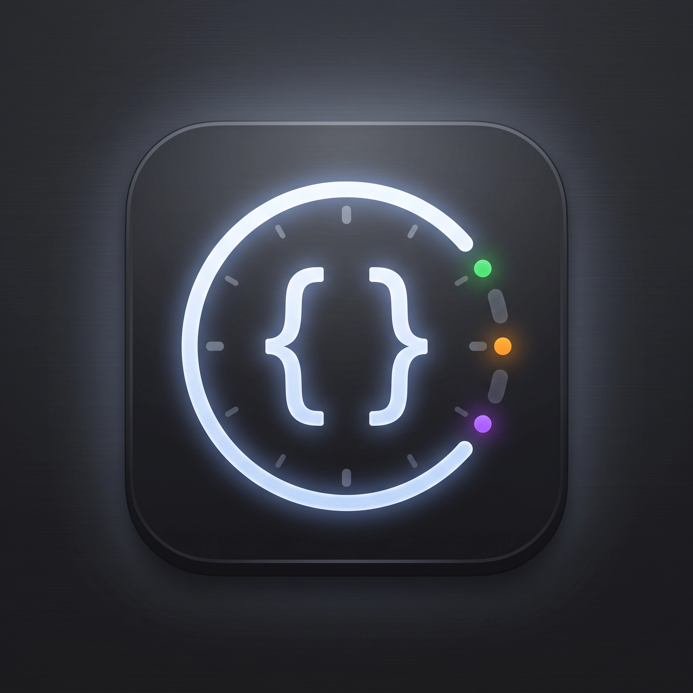
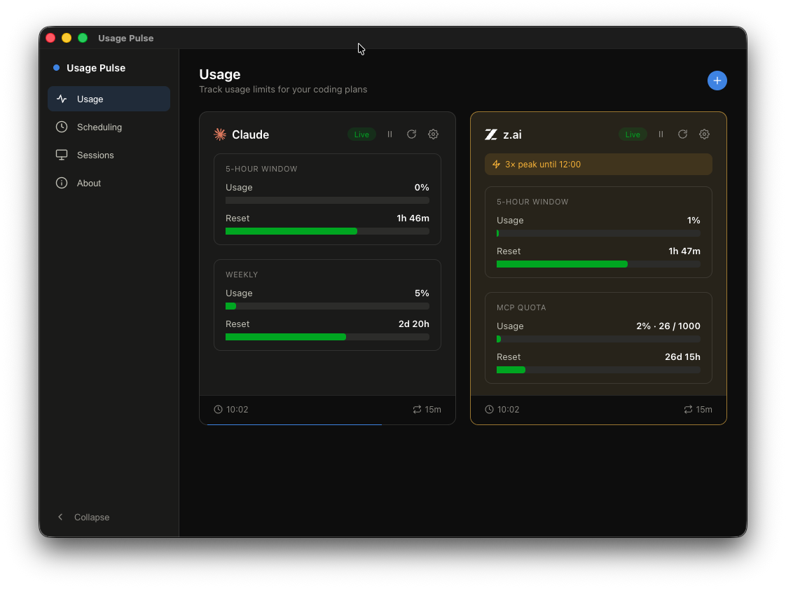
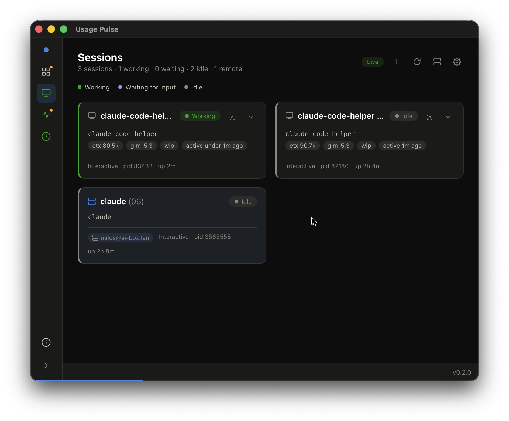
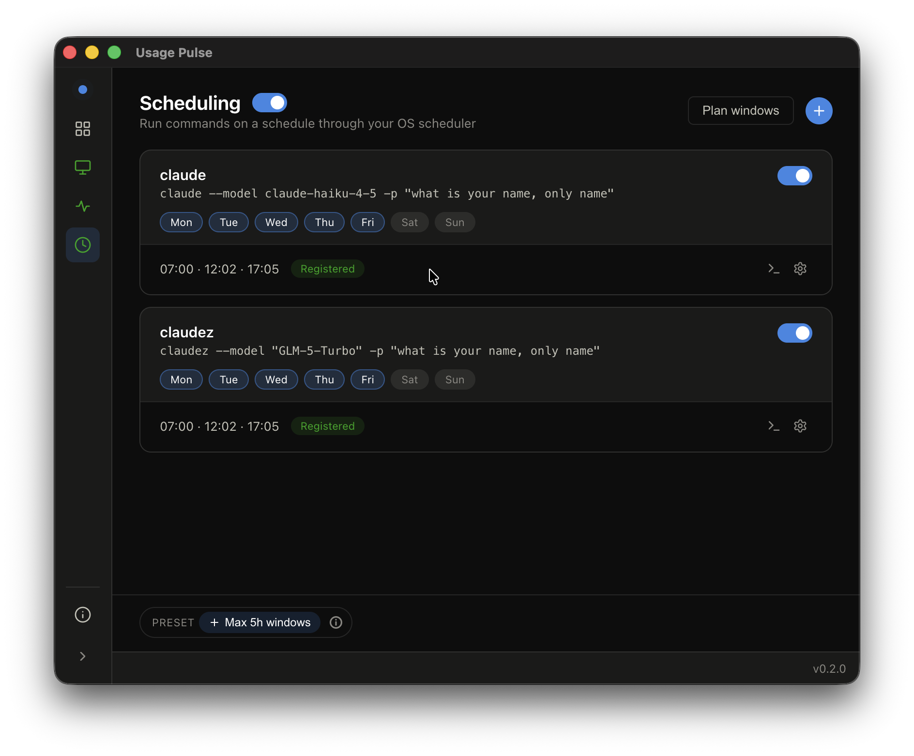
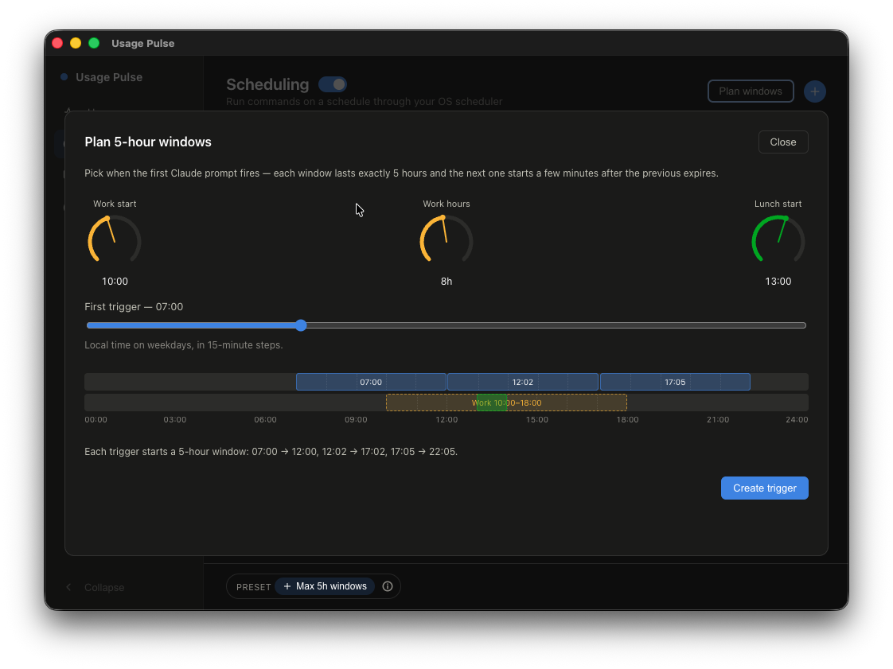

<p align="center">
  
</p>

<h1 align="center">Usage Pulse</h1>

<p align="center">
  
  
  
  
</p>

A small Electron + TypeScript desktop app for people who run several Claude Code sessions at once. It does three things:

- **Usage limits** — continuously pings your coding-plan providers and shows how much of your limits you have consumed: the 5-hour window as a ring, the longer window (weekly for Claude, monthly for z.ai) as a bar.
- **Active sessions** — lists your running Claude Code sessions, local and on remote SSH hosts, with their project folder and transcript stats, so you can see what every window is up to at a glance.
- **Scheduling** — registers a Claude command trigger with your OS scheduler (launchd/systemd) timed to the start of each 5-hour usage window. A provider's window opens when your first prompt lands, so a tiny scheduled prompt at 07:00, 12:02 and 17:05 deliberately opens fresh windows that together cover an 8-hour workday — instead of one window that starts whenever you happen to begin and runs out mid-afternoon.

## Status: Proof of Concept

Usage Pulse is at **v0.1.0** and still a proof of concept. It was built through rapid AI-assisted iteration ("vibe coding") rather than carefully reviewed engineering, so expect rough edges, missing pieces, and breaking changes without notice. While it remains a POC the version stays on `0.x`; the move out of the POC phase coincides with the major version moving to `1`.

## Download & install

Downloads live on the [GitHub Releases](https://github.com/beecode-rs/usage-pulse/releases) page.

**macOS** (Apple Silicon & Intel, one universal build): download `Usage-Pulse-<version>-universal.dmg` and drag **Usage Pulse** to Applications. The app is unsigned, so macOS blocks the first launch — after one failed open attempt, go to **System Settings → Privacy & Security → Open Anyway**, or clear the quarantine flag from a Terminal:

```bash
xattr -cr '/Applications/Usage Pulse.app'
```

**Ubuntu — AppImage**: make it executable and run it (no install needed):

```bash
chmod +x Usage-Pulse-<version>.AppImage
./Usage-Pulse-<version>.AppImage
```

**Ubuntu — deb package**:

```bash
sudo apt install ./usage-pulse_<version>_amd64.deb
```

Scheduled triggers registered from the AppImage re-invoke the AppImage file itself, so they keep working after reboots.

## Why this exists

I usually have three or four Claude Code sessions running at the same time, each in its own window. I rotate between them: write a prompt in one, move to the next, read what landed there, repeat — by the time I circle back, the first one is done. That loop only works while two questions stay answerable at a glance: _which session is waiting for me?_ and _how much of my usage window is left?_ Usage Pulse answers both in one place, instead of a terminal here and a provider dashboard there.

## Screenshots

### Usage



The main dashboard. One card per tracker — here a Claude and a z.ai account, each with a Live badge, a pause button, and a gear that opens its settings (display name, token, remove). Every card shows the 5-hour window (utilization % plus a bar counting down to the reset) and the long window: weekly for Claude, MCP quota with consumed counts (e.g. `26 / 1000`) for z.ai. The footer tracks the last poll time and interval, and **+ Add** in the header creates a new tracker.

### Sessions



All running Claude Code sessions, local and on remote SSH hosts, with a summary line (`2 sessions · 2 working · 0 waiting · 0 idle · 1 remote`) and a status legend. Each card shows the project folder, transcript stats (context tokens, model, branch), how recently it was active, plus pid and uptime. Clicking a card focuses that session's terminal window so you can jump straight to the one waiting for you (macOS, Linux X11).

### Scheduling



Run commands on a schedule through your OS scheduler (launchd on macOS, systemd on Linux). The master toggle enables the whole feature; each task has its own toggle, a command, the weekdays it runs on, and its trigger times. The status shows whether the task is registered with the scheduler, and each task can be run immediately or edited from its row. The **+ Max 5h windows** preset and the **Plan windows** button both lead to the planner below.

### Plan 5-hour windows



A dialog for stacking 5-hour usage windows over your workday: set work start, work hours, and lunch start on the dials, then drag the first-trigger slider (15-minute steps). The timeline previews the resulting windows against your work and lunch bars, warns you if the windows miss the edges of the workday, and **Create trigger** writes the computed start times back as a new scheduled task.

## Feature status

Done:

- [x] Usage tracking (Claude, z.ai)
- [x] Session tracking (local + SSH remote hosts)
- [x] Session focus (macOS, Linux X11)
- [x] Scheduler (macOS launchd, Linux systemd)
- [x] Claude system token (macOS, Linux)
- [x] Installable release builds (macOS dmg, Linux AppImage/deb via GitHub Releases)

Planned:

- [ ] Windows support (scheduler, focus, system token)
- [ ] Usage notifications (when a window's utilization turns red or is used up)
- [ ] Header semaphores (per-provider usage indicators and a count of sessions waiting for a response)

## Trackers

Any number of provider trackers — Claude, z.ai, or several of each — each with its own token and settings behind the card's gear button. See [resource/doc/trackers.md](resource/doc/trackers.md) for how trackers are stored, the endpoints each provider polls, and how to get a token for each provider.

Tokens stay on your machine: they are stored only in `usage-pulse-settings.json` inside the app's userData folder and are sent exclusively to the provider their tracker belongs to. Nothing is telemetry'd anywhere.

## Development

Requires [Node.js](https://nodejs.org) and [pnpm](https://pnpm.io).

```bash
git clone https://github.com/beecode-rs/usage-pulse.git
cd usage-pulse
pnpm install
pnpm dev
```

Other scripts:

- `pnpm build` — build main/preload/renderer into `out/`
- `pnpm start` — run the built app
- `pnpm typecheck` — typecheck the node and web projects
- `pnpm lint` / `pnpm lint-fix` — ESLint + Prettier + json-sort-cli
- `pnpm dist:mac` / `pnpm dist:linux` — build installers into `dist/` (universal dmg; AppImage + deb)
- `pnpm pack:dir` — unpacked build into `dist/` for a quick local smoke test

### Releasing

Releases are tag-driven. From `main` (after merging what you want to ship):

```bash
pnpm release:patch   # or release:minor / release:major
```

That bumps `package.json`, commits, tags `v<version>`, and pushes. GitHub Actions then runs the quality gate (typecheck, lint, contract tests), builds the macOS and Linux installers — failing if the tag does not match the package version — and publishes them to the [Releases](https://github.com/beecode-rs/usage-pulse/releases) page with auto-generated notes. The workflow can also be run manually ("Run workflow") as a dry run that builds everything without creating a release.

## Architecture

Electron's three-process layout: shared cross-process models, a main process with repos, services, and per-OS scheduler strategies, and a React renderer. The full source tree with per-file notes lives in [resource/doc/architecture.md](resource/doc/architecture.md).

## Disclaimer

Usage Pulse relies on an undocumented Claude usage endpoint, and its scheduler deliberately fires small prompts to open fresh 5-hour usage windows. Both are use-at-your-own-risk: providers may change or restrict this behavior at any time, and how you use the app is your responsibility under each provider's terms of service.

## Contributing

Issues and pull requests are welcome on [GitHub](https://github.com/beecode-rs/usage-pulse/issues). Keep the [feature status](#feature-status) in mind — help is most useful on the planned items (Windows support).

## License

[MIT](LICENSE)
